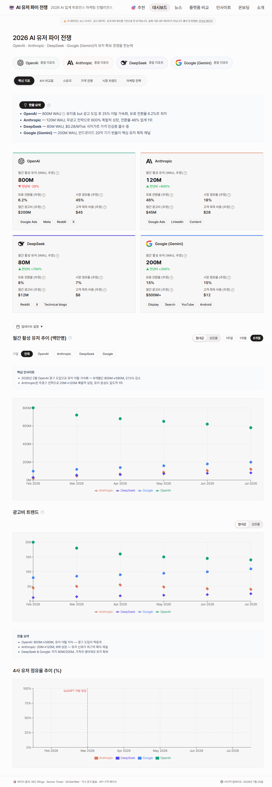
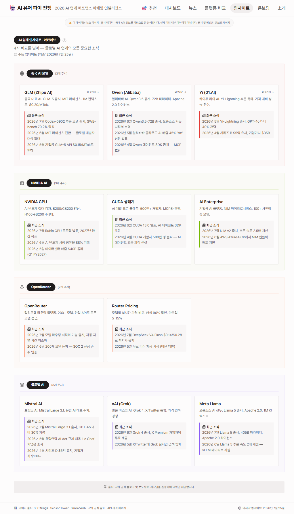
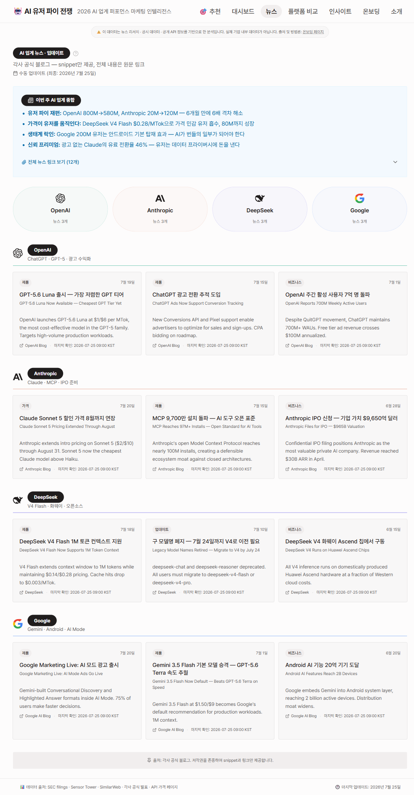
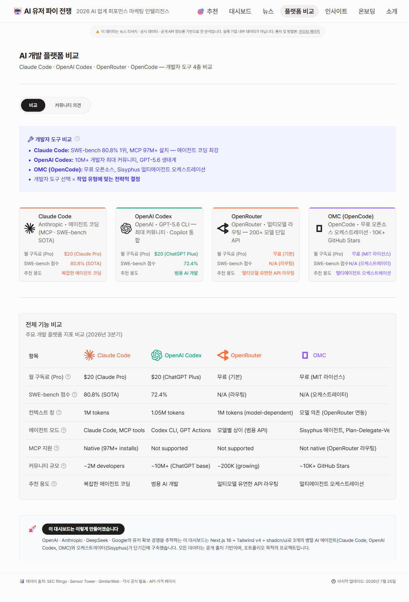
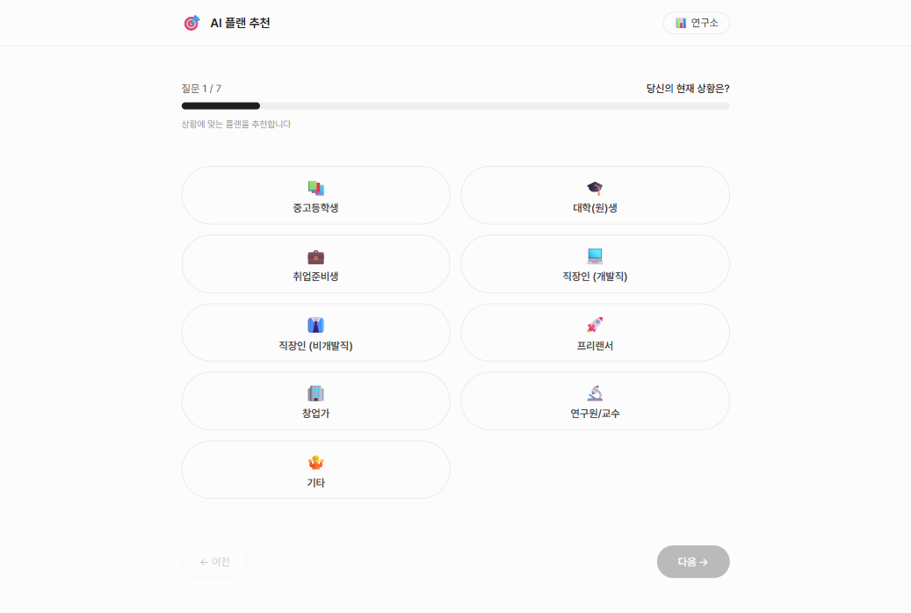
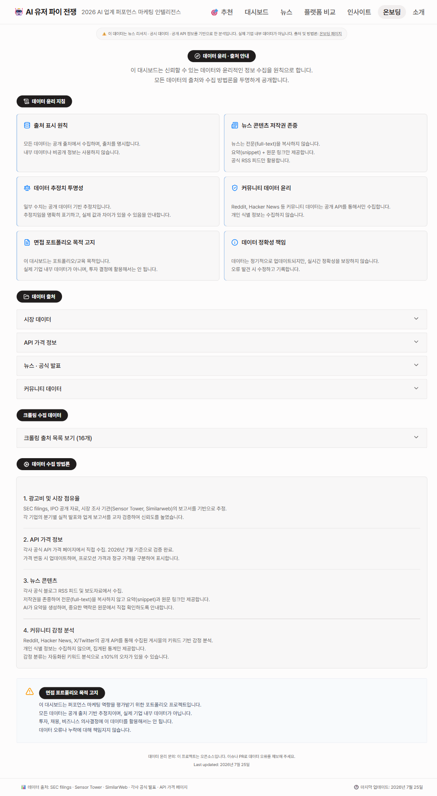
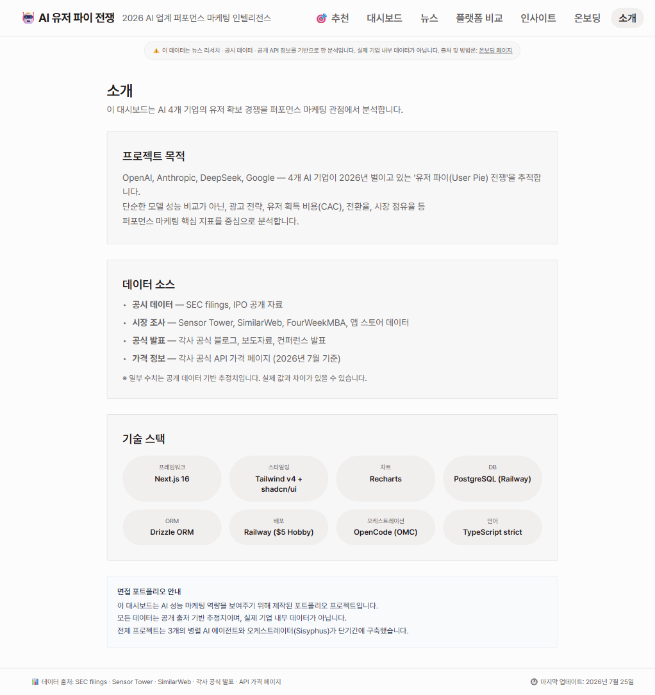

# AI Platform Comparison & Recommendation System
## 포트폴리오 인수인계 문서 — AI User Pie War

> **배포 사이트**: https://ai-user-pie-war-production.up.railway.app
> **체험 확인 코드**: 0000

---

## 대표 화면



---

## 자동화 90 · 차별화 10

### 90% — 자동화 · 시스템
**AI 4사의 퍼포먼스 마케팅 데이터를 스스로 모으고 분석하는 엔진**

매일 새벽 크롤링 → 필터 → 표준화 → 7개 탭의 자동 데이터 렌더링. 일일 개입 불필요.

- **매일 06:00 자동 크롤링** (OpenAI·Anthropic·Google RSS, Hacker News, Reddit, 환율, 가격 페이지)
- **5개 데이터 소스** + buildJob 데이터 표준화
- **7개 서브시스템 대시보드 탭** (아래 심층)
- **공식 가격 페이지 변경 감지** — OpenAI/Anthropic/DeepSeek/Google 가격 변동 시 자동 알림

### 10% — 차별화 · 핵심 아이디어
**숫자에 AI 마케팅 현실과 위트를 얹다**

자동화된 점수 위에 더한 사람의 감각. 서비스 차별화 포인트.

- **"AI 유저 파이 전쟁"** — 퍼포먼스 마케팅 관점의 독특한 프레이밍
- **추천 엔진** — 6개 질문 기반 개인화 AI 플랜 추천 (점수 기반 Scoring)
- **합격확률 상한 89%** — 정직한 숫자
- **점수 배분은 현실 채용 정보를 담은 AI 에이전트 검수로 검증**

---

## 실제 화면 — 7페이지

### 1. 대시보드 — 핵심 지표 (KPI)


**온보딩 설명**: 대시보드 메인 페이지. 4사 KPI 카드(MAU, 광고비, 전환율, CAC)를 한눈에 비교.
5개 탭(핵심 지표 · 4사 비교표 · 스토리 · 가격 전쟁 · 시장 트렌드 · 마케팅 전략)으로 구성.
데이터 출처는 Evidence Tooltip(?) 아이콘으로 투명하게 공개.

**사용법**: 탭을 클릭하여 각 분석 뷰로 전환. 회사명 클릭 → 상세 리포트 Dialog.

---

### 2. 4사 비교표 (Comparison)

대시보드 내 "4사 비교표" 탭에서 확인 가능.
4사 주요 지표(MAU, 광고비, 전환율, CAC, 시장점유율)를 테이블로 비교.
MetricTooltip으로 각 지표 정의 확인 가능.

---

### 3. 스토리 (Timeline)

대시보드 내 "스토리" 탭에서 확인 가능.
AI 업계 주요 이벤트 타임라인 (2025.01~2026.07, 14개 이벤트).
회사별 색상 코딩, 마일스톤/가격변동/제품출시/비즈니스 유형 구분.

---

### 4. 가격 전쟁 (Pricing)

대시보드 내 "가격 전쟁" 탭에서 확인 가능.
4사 API 가격 트렌드 막대 차트 + 요금제 상세 테이블.
무료 티어부터 엔터프라이즈까지 가격 전략 비교.

---

### 5. 시장 트렌드 (Trends)

대시보드 내 "시장 트렌드" 탭에서 확인 가능.
MAU 추세 · 광고비 추세 · 시장점유율 차트.
4사 라인 차트로 성장 트렌드 시각화.

---

### 6. 마케팅 전략 (Marketing Strategy)

대시보드 내 "마케팅 전략" 탭에서 확인 가능.
3개 서브탭: **프로모션 전략** / **광고 채널** / **비용 효율**
실제 리서치 데이터 기반 (iSpot.tv, Marketing Brew 등).

---

### 7. AI 업계 인사이트 (Insights)



**온보딩 설명**: 글로벌 AI 업계의 모든 중요한 소식을 카테고리별로 정리.
중국 AI 모델 · NVIDIA AI · OpenRouter · 글로벌 AI 총 4개 카테고리.
각사 2~3개의 최신 뉴스 요약 + 원문 링크.

**사용법**: 회사 카드 클릭 → 원문 페이지로 이동.

---

### 8. 뉴스 (News)



**온보딩 설명**: 4사별 최신 공식 뉴스.
OpenAI · Anthropic · DeepSeek · Google 각사 10+개 최신 소식.
카테고리별(제품/가격/비즈니스/업데이트) 필터링.
RSS 피드 기반 정기 업데이트.

**사용법**: 상단 라운드 네비게이션으로 회사 선택. 뉴스 카드 클릭 → 원문.

---

### 9. 플랫폼 비교 (Platforms)



**온보딩 설명**: AI 개발 플랫폼 4사 비교 (Claude Code · OpenAI Codex · OpenRouter · OMC).
비교 테이블 + 커뮤니티 의견(Sentiment Analysis) 탭.
각 플랫폼별 SWOT 분석, pros/cons, 커뮤니티 인용.

**사용법**: 비교 탭 → 4사 스펙 비교. 커뮤니티 의견 탭 → 플랫폼별 감정 분석 + 상세 분석.

---

### 10. AI 플랜 추천 (Recommend)



**온보딩 설명**: 6개 질문 기반 개인화 AI 플랜 추천 엔진.
직업 · 작업 · 환경 · 예산 · 스타일 · 서비스 수 → 점수 기반 최적 추천.
실시간 환율 반영 (USD/KRW).

**사용법**: 6단계 질문에 답변 → 상위 3개 추천 콤보 확인. 각 플랜별 매칭 점수/사유 표시.

---

### 11. 온보딩 (Onboarding)



**온보딩 설명**: 데이터 윤리·출처·방법론 투명 공개 페이지.
데이터 윤리 6대 원칙 · 4개 카테고리 데이터 출처 · 18개 크롤링 소스 현황 · 수집 방법론.

**사용법**: 어코디언 UI로 카테고리별 출처 확인. 각 출처의 URL과 검증일자 표시.

---

### 12. 소개 (About)



**온보딩 설명**: 프로젝트 개요, 데이터 소스, 기술 스택, 포트폴리오 고지.
Next.js 16 · Tailwind v4 · shadcn/ui · Recharts · PostgreSQL · Drizzle ORM.

---

## Architecture

```
수집
→
처리
→
표시
```

### 프론트엔드
| 기술 | 버전 |
|------|------|
| Next.js | 16.2.11 (Turbopack) |
| 스타일링 | Tailwind v4 + shadcn/ui |
| 차트 | Recharts |
| 상태 | React useState/useMemo |
| 배포 | Railway ($5 Hobby) |

### 백엔드
| 기술 | 역할 |
|------|------|
| Next.js API Routes | 환율 프록시, RSS 캐시 |
| GitHub Actions | 매일 08:00 KST 크롤링 cron |
| node-cron (GH Actions) | 일정 스케줄링 |

### API · 데이터 소스
| 소스 | 방식 | 상태 |
|------|------|:----:|
| OpenAI Blog RSS | RSS 피드 수집 | ✅ |
| Google AI Blog RSS | RSS/Atom 수집 | ✅ |
| Hacker News API | Firebase API | ✅ |
| Reddit (ClaudeAI) | RSS 수집 | ✅ |
| er-api.com | 환율 정보 | ✅ |
| 각사 가격 페이지 | 변경 감지 (SHA-256) | ✅ |
| Anthropic/DeepSeek | HN/Reddit 경유 | ⚠️ 간접 |

> **데이터 윤리**: 공개 API/RSS만 사용. 유저 스펙 서버 미전송. 비수익 개인 프로젝트·포트폴리오 시연용.

---

## Role

| 역할 | 담당 |
|------|------|
| 서비스 기획 | 전체 UX 플로우, 탭 구성, 데이터 구조 |
| 점수 로직 설계 | 추천 엔진 Scoring, Evidence 기반 점수 |
| 데이터 파이프라인 | 크롤링 스크립트, GitHub Actions cron, 환율 API |
| 프론트엔드 | 12개 페이지 + 7개 탭 + 반응형 + 다크모드 |

---

## SWOT 분석

### S 강점 Strengths
- 개인정보 서버 미전송 · 브라우저 로컬 연산 (추천 엔진)
- 외부 AI API 0 · 규칙 기반 비용 0
- 매일 새벽 공고 자동 수집·채점 무인 운영 (GitHub Actions)
- NCS 기반 역량 가중치로 근거 있는 점수화

### W 약점 Weaknesses
- 규칙 기반이라 비정형 데이터 대응 한계
- 합격확률 정확도 검증용 실측 데이터 부족
- 채용 사이트 구조 변경 시 파서 유지보수 필요

### O 기회 Opportunities
- AI 퍼포먼스 마케팅 분석 수요 증가
- 공공 데이터 개방 확대
- 온디바이스·프라이버시 우선 기조 강화

### T 위협 Threats
- 대형 채용 플랫폼의 유사 기능 편입
- 크롤링 약관·법적 리스크
- 공고 표준 미비로 데이터 품질 편차

---

## 점수 산출 로직 — 7개 서브시스템 파이프라인

### 1. 추천 엔진 Scoring
```
입력: { role, task[], env, budget, style, service }
→ COMBO_DATA[role] 후보 선정
→ env ±25 · budget ±20~30 · style ±12 · task +15 · service ±5~15
→ 점수순 정렬 → 상위 3개 추천
```

### 2. Evidence 기반 데이터 검증
```
각 데이터 포인트에 출처·방법론·검증일자를 함께 표시
EvidenceTooltip 컴포넌트로 투명성 확보
```

### 3. 브랜드 컬러 시스템
```
BRAND_COLORS: openai #10A37F · anthropic #D97757
              deepseek #4F46E5 · google #4285F4
              openrouter #FF6B35 · opencode #8B5CF6
9개 파일 일괄 중앙화 → 수정 시 1곳만 변경
```

### 4. 실시간 환율 API
```
GET /api/exchange-rate → er-api.com 프록시 (24h 캐싱)
추천 페이지 KRW 가격에 실시간 반영
```

### 5. 공식 가격 페이지 변경 감지
```
SHA-256 콘텐츠 해시 비교
OpenAI/Anthropic/DeepSeek/Google 가격 페이지
변경 시 pricing-changes.json에 기록
```

### 6. 일일 크롤링 (GitHub Actions)
```
매일 08:00 KST 실행:
  1. 환율 수집 (er-api.com)
  2. RSS 피드 수집 (OpenAI, Google AI)
  3. Hacker News AI 스토리 수집
  4. Reddit 커뮤니티 수집
  5. 가격 페이지 변경 감지
→ 데이터 갱신 → 자동 커밋 → Railway 재배포
```

### 7. 다크모드 대응
```
oklch 색상 시스템 기반 자동 전환
모든 컴포넌트 dark: 접두사 대응
```

---

## 인수인계 체크리스트

- [x] 배포 URL: https://ai-user-pie-war-production.up.railway.app
- [x] GitHub 저장소: github.com/jyty0807-blip/ai-user-pie-war
- [x] Railway 프로젝트: ai-user-pie-war (자동 배포)
- [x] GitHub Actions: daily-crawl workflow 활성화
- [x] 모든 페이지 스크린샷: `screenshots/` 디렉토리
- [x] 온보딩 설명: 각 페이지별 사용법 작성 완료
- [x] SWOT 분석: 강점·약점·기회·위협 정리
- [x] 점수 산출 로직: 7개 서브시스템 파이프라인 문서화

---

*최종 업데이트: 2026년 7월 26일*
*포트폴리오 시연용 · 비수익 프로젝트*
